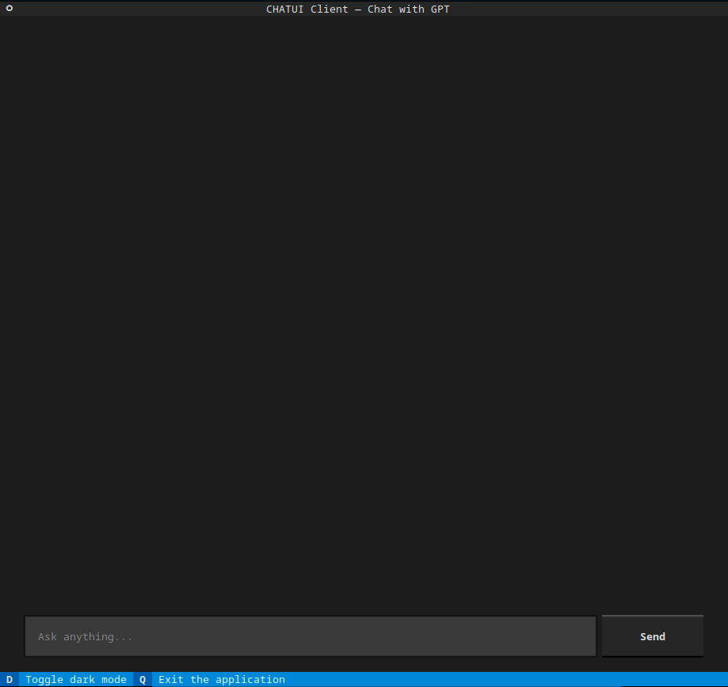

# A Chat Terminal User Interface

When experimenting with LLMs or even trying to demonstrate an example, we usually use either the simple approach of `input` in python, or choose a more complicated solution like creating a web app using tools like *streamlit*. Both approaches are fine!

Here is another solution where you can experiment with your chatbot in your terminal using a more appealing interface.

The module is created using [Textual](https://textual.textualize.io/).

## How to use

The idea is to copy the `chatui` folder in your project and use it as a module. Import the APP and get started. Check the following snippet:

```python
from chatui.app import ChatApp


if __name__ == "__main__":
    app = ChatApp()
    app.set_callback(my_callback)  # This is important
    app.run()
```

Your callback must be of the form :

```python
Callable[[str], Awaitable[str]]
```

Meaning it has to accept a string as query and return an awaitable (string).

Feel free to check the implementation of `generate_response` in the `chatgpt.py` example:

```python
async def generate_response(query: str) -> str:
    ...
```

### With OpenAI API

It comes with a simple example using OpenAI - ChatGPT API.
Check the configuration file `config.ini`. In the `OPEANAI` section you can define your API Key and the model you want to use.

```ini
[OPENAI]
API_KEY=sk-...
MODEL=gpt-3.5-turbo
```

## Configurations

You can set the app title, subtitle, and the location of your custom css file. Just update the respective field in the `TUI` section of `config.ini` file. Here are the default values:

```ini
[TUI]
TITLE=CHATUI Client
SUB_TITLE=Chat with GPT
CSS_PATH=./chatui/style.tcss

```

## Demo

Here is a simple example of how it looks like.

- Toggle Light / Dark Mode


- Chat with GPT-3.5-turbo (OpenAI)



## Notes

Do not forget to install the requirements using `pip install -r requirements.txt`.
